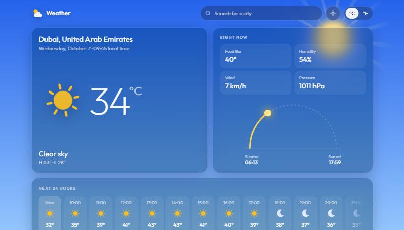

# Weather

Live weather for any place, the next 24 hours and a 7-day forecast, over a sky that moves with the weather: drifting clouds, a turning sun, stars and a crescent moon at night, rain and snow on a canvas, and lightning in storms.

**Live:** https://weather-app-lac-iota-59.vercel.app



## Features

- Search with suggestions as you type (arrow keys and Enter work), or use your device location.
- Current conditions with a count-up temperature, feels-like, humidity, wind, pressure, and a sun arc that tracks the day from sunrise to sunset.
- Hourly strip for the next 24 hours and a 7-day list with temperature range bars on a shared week scale.
- °C / °F switch; wind follows it (km/h or mph). Your last place and unit are remembered.
- Times are shown in the place's own time zone, not the viewer's.
- Refreshes itself every 15 minutes while the tab is open.
- Accessible: labelled controls, a combobox for search, screen-reader announcements on change, visible focus, and `prefers-reduced-motion` respected (the sky holds still, nothing animates).

## How it works

No framework and no build step: plain HTML, CSS and ES modules.

| File | Job |
|---|---|
| `src/api.js` | [Open-Meteo](https://open-meteo.com/) forecast and geocoding (no API key), plus BigDataCloud's client-side reverse geocoding for "my location" |
| `src/weather.js` | Pure helpers: WMO weather codes, units, local times, range bars, daylight |
| `src/scene.js` | The animated sky: CSS layers driven by `data-kind` / `data-time`, a canvas for rain and snow, storm flashes |
| `src/icons.js` | Inline animated SVG weather icons |
| `src/main.js` | State, rendering, search, location, units |

The sky gradient animates between weathers through registered CSS custom properties (`@property`), and place changes use the View Transitions API where the browser has it.

To see any sky regardless of the real weather, add `?sky=` (`clear`, `partly`, `cloudy`, `fog`, `drizzle`, `rain`, `snow`, `storm`) and optionally `&time=night`, for example `?sky=storm&time=night`.

## Run it

Serve the folder with any static server, for example:

```bash
npx serve .
```

Tests use Node's built-in runner (Node 20+):

```bash
npm test
```

## Credits

Weather and geocoding data by [Open-Meteo](https://open-meteo.com/) under CC BY 4.0. Reverse geocoding by [BigDataCloud](https://www.bigdatacloud.com/).
